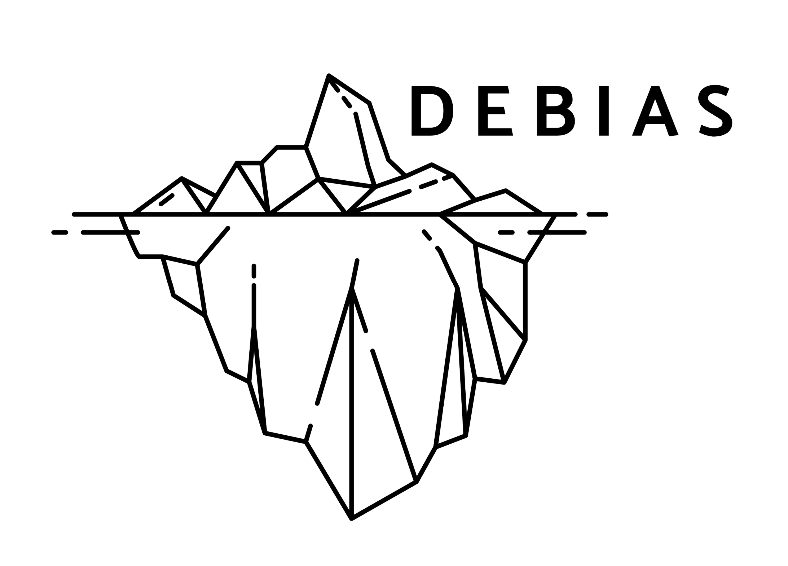

[](#contributors-)
<!-- ALL-CONTRIBUTORS-BADGE:START - Do not remove or modify this section -->
[](#contributors-)
<!-- ALL-CONTRIBUTORS-BADGE:END -->



# debiasR R Package Repository

Welcome to the **debiasR** repository!  
This package is part of the **DEBIAS** project — an international research initiative dedicated to understanding and correcting biases in human mobility data derived from mobile phone records.  

The **debiasR** package provides statistical methods and tools to generate **correction factors** for population and mobility estimates, enabling researchers and practitioners to produce **bias-adjusted human mobility data** suitable for demographic, policy and scientific applications.

The package implements a range of approaches including inverse penetration weighting, selection rate models, raking ratio adjustments, coefficient regression, and Bayesian multilevel modelling. 

Our goal is to (1) increase the reliable and ethical use of mobile phone–derived mobility for scientific and policy applications; and, (2) ensure reproducibility, transparency and comparability in the use of mobile phone–derived mobility data across contexts.

---

## 👥 Core Development Team

The core development team consists of **Francisco Rowe** and **Carmen Cabrera** (University of Liverpool).  
We actively maintain and develop the package and warmly invite contributions from the wider research community — including new methods, bug reports, feature requests, and ideas for improvement.

If you’re interested in collaborating or contributing, please join our growing open-source community.

---

## 🚀 Getting Started

1. **Install and load the package** (instructions forthcoming when the package is published to CRAN).  
2. **Explore the documentation** for available functions and workflows (see `/R/` and `/man/` folders).  
3. **Use example datasets** such as `toy_mpd_od` to test your workflow or build your own experiments.  

---

## 🛠️ Contributing

We welcome contributions of all kinds — **code, documentation, issues, examples, or methodological ideas**.
Please read our [Contributing Guidelines](CONTRIBUTING.md) for step-by-step instructions on how to:

- Fork and clone the repository
- Create a new branch for your changes
- Use issue and pull request templates
- Get acknowledged with the All Contributors Bot
- Resolve merge conflicts

If you’re new to open source, our guidelines are designed to make it easy for you to get started.  
If you have questions, open an issue or start a discussion!

---

## 🙋 License

This repository uses a dual-licensing approach:

- **MIT License** for all software code (see [LICENSE](LICENSE))
- **Creative Commons Attribution 4.0 International (CC BY 4.0)** for documentation, data, and non-code content

See the [LICENSE](LICENSE) file for full details.

---

## 🗂️ Repository Structure

To be updated.

- `assets/` — Images, diagrams, and other media files
- `R/` — Core package functions  
- `data-raw/` — Scripts for building example datasets  
- `man/` — Documentation for all exported functions  
- `tests/` — Automated test files  
- `.github/` — Community health files (issue and pull request templates)  
- `CONTRIBUTING.md` — Contribution guidance  
- `CODE_OF_CONDUCT.md` — Community standards and expectations  
- `LICENSE` — Licensing information  
- `README.md` — Package overview and usage instructions  

## 🎉 Acknowledging Contributors

We use the [All Contributors Bot](https://allcontributors.org/) to recognise everyone’s work—code, docs, ideas, design and more.  
After your PR is merged, comment on an issue or PR:

```
@all-contributors please add @your-username for code, doc, etc.
```
(Replace `@your-username` and the contribution types as appropriate.)
See the [emoji key](https://allcontributors.org/docs/en/emoji-key) for available contribution types.

Thank you for helping us build open, collaborative and impactful projects with DEBIAS!

<!-- ALL-CONTRIBUTORS-LIST:START - Do not remove or modify this section -->
<!-- prettier-ignore-start -->
<!-- markdownlint-disable -->
<table>
  <tbody>
    <tr>
      <td align="center" valign="top" width="14.28%"><a href="http://franciscorowe.com"><br /><sub><b>Francisco Rowe</b></sub></a><br /><a href="https://github.com/fcorowe/TEST2/commits?author=fcorowe" title="Documentation">📖</a> <a href="https://github.com/fcorowe/TEST2/commits?author=fcorowe" title="Code">💻</a> <a href="https://github.com/fcorowe/TEST2/issues?q=author%3Afcorowe" title="Bug reports">🐛</a> <a href="#content-fcorowe" title="Content">🖋</a> <a href="#design-fcorowe" title="Design">🎨</a> <a href="#example-fcorowe" title="Examples">💡</a> <a href="#ideas-fcorowe" title="Ideas, Planning, & Feedback">🤔</a> <a href="#infra-fcorowe" title="Infrastructure (Hosting, Build-Tools, etc)">🚇</a> <a href="#maintenance-fcorowe" title="Maintenance">🚧</a> <a href="#platform-fcorowe" title="Packaging/porting to new platform">📦</a> <a href="#projectManagement-fcorowe" title="Project Management">📆</a> <a href="#research-fcorowe" title="Research">🔬</a> <a href="https://github.com/fcorowe/TEST2/pulls?q=is%3Apr+reviewed-by%3Afcorowe" title="Reviewed Pull Requests">👀</a> <a href="#tool-fcorowe" title="Tools">🔧</a> <a href="https://github.com/fcorowe/TEST2/commits?author=fcorowe" title="Tests">⚠️</a></td>
    </tr>
  </tbody>
</table>

<!-- markdownlint-restore -->
<!-- prettier-ignore-end -->

<!-- ALL-CONTRIBUTORS-LIST:END -->


## Contributors ✨

Thanks goes to these wonderful people ([emoji key](https://allcontributors.org/docs/en/emoji-key)):

<!-- ALL-CONTRIBUTORS-LIST:START - Do not remove or modify this section -->
<!-- prettier-ignore-start -->
<!-- markdownlint-disable -->
<!-- markdownlint-restore -->
<!-- prettier-ignore-end -->
<!-- ALL-CONTRIBUTORS-LIST:END -->

This project follows the [all-contributors](https://github.com/all-contributors/all-contributors) specification. Contributions of any kind welcome!
